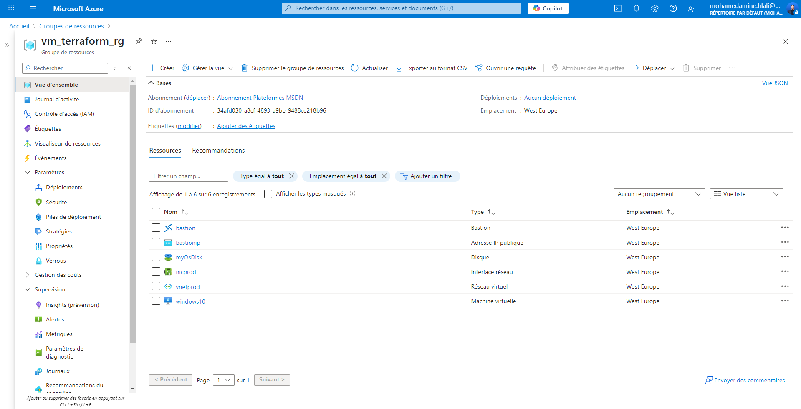
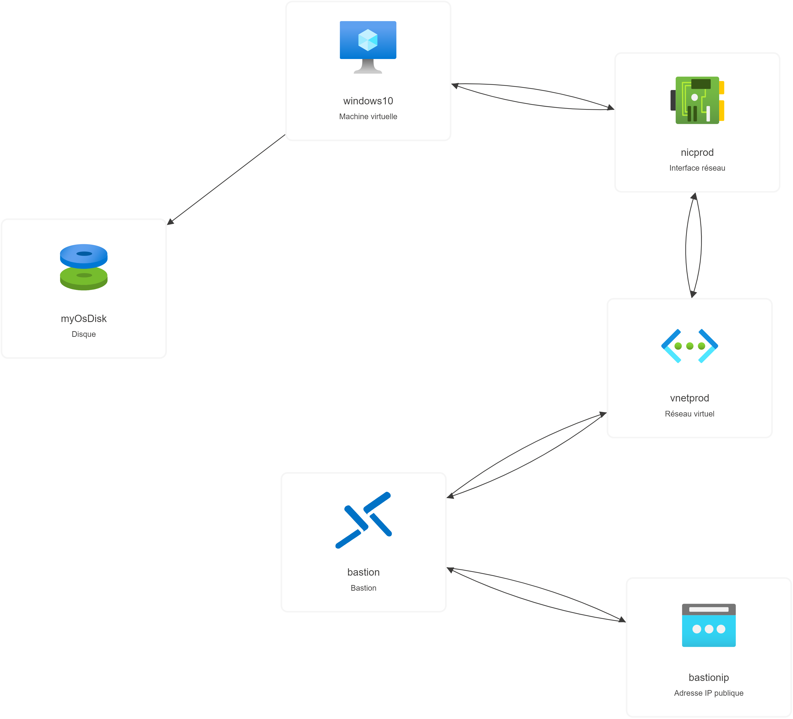
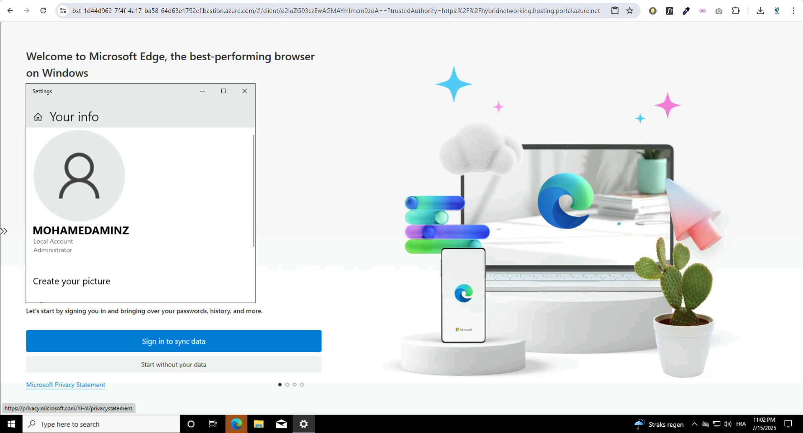

# 🚀 Terraform Project: Azure Bastion + Windows VM + Secure Network

## 👨‍💻 Author
**Hlali Mohamed Amine**

---

## 📘 Overview

This project demonstrates the provisioning of a secure and production-ready infrastructure on Microsoft Azure using **Terraform**. It includes:

- A **Virtual Network (VNet)** with isolated subnets
- A secure **Windows Virtual Machine (VM)** without a public IP
- A fully configured **Azure Bastion Host** for secure browser-based RDP access
- Infrastructure as Code (IaC) best practices using reusable variables
- A foundation for deploying DevOps or cloud-native tools inside the VM

This setup is ideal for cloud professionals who want to implement **zero-trust architecture**, **bastion-based access**, and **immutable infrastructure** principles.

---

## 🧱 Infrastructure Components

| Component            | Description                                                                 |
|----------------------|-----------------------------------------------------------------------------|
| `azurerm_resource_group` | Creates the resource group to hold all other resources                     |
| `azurerm_virtual_network` | A private virtual network (`10.0.0.0/16`)                                  |
| `azurerm_subnet.vm`       | Subnet for the virtual machine (`10.0.0.0/24`)                             |
| `azurerm_subnet.bastion`  | Dedicated subnet for Azure Bastion (`10.0.1.0/27`)                          |
| `azurerm_network_interface` | Attaches the VM to the subnet with a dynamic private IP                  |
| `azurerm_windows_virtual_machine` | Deploys a Windows 10 Pro VM with local admin credentials        |
| `azurerm_public_ip`         | Static public IP address used by Bastion Host                            |
| `azurerm_bastion_host`      | Configures a Bastion Host for secure remote access to the VM             |

---

## 🔐 Security Features

- ✅ No public IP on the virtual machine
- ✅ Access via Azure Bastion only
- ✅ Subnet-level segmentation
- ✅ Secure admin password stored in `.tfvars` (excluded via `.gitignore`)

---

## 📸 Architecture & Screenshots

> 📌 Replace the image links below with actual screenshots from your Azure portal or local machine

### 1️⃣ Resource Group Overview


### 2️⃣ Network Topology (VNet, Subnets, Bastion, VM)


### 3️⃣ VM Access via Bastion


---

## ⚙️ How to Deploy

```bash
# 1. Initialize Terraform
terraform init

# 2. Preview the plan
terraform plan -out=tfplan

# 3. Apply the plan
terraform apply tfplan
```

> 🔐 **Important:** Do not expose your `.tfvars` or state files. Use a proper secret management system in production.

---

## 📦 Future Enhancements

- Provision DevOps tools (Azure CLI, kubectl, Helm) via VM Extensions
- Connect VM to Azure DevOps Pipelines
- Add NSGs (Network Security Groups) for tighter access control
- Enable Diagnostics and Monitoring

---

## 📄 License

This project is open for demonstration and educational purposes.

---

## 🙌 Connect

Feel free to reach out via [LinkedIn](https://www.linkedin.com/in/mohamed-amine-hlali/) or GitHub if you want to collaborate on real-world Azure + Terraform projects.
